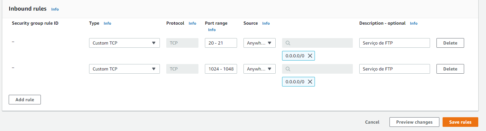
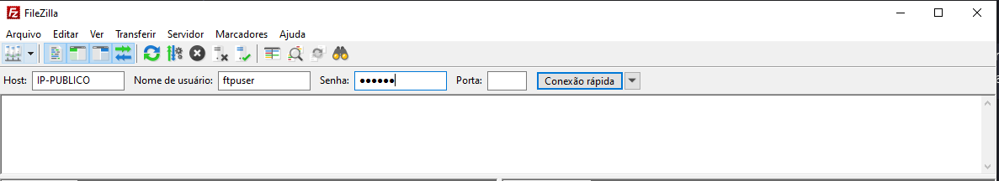
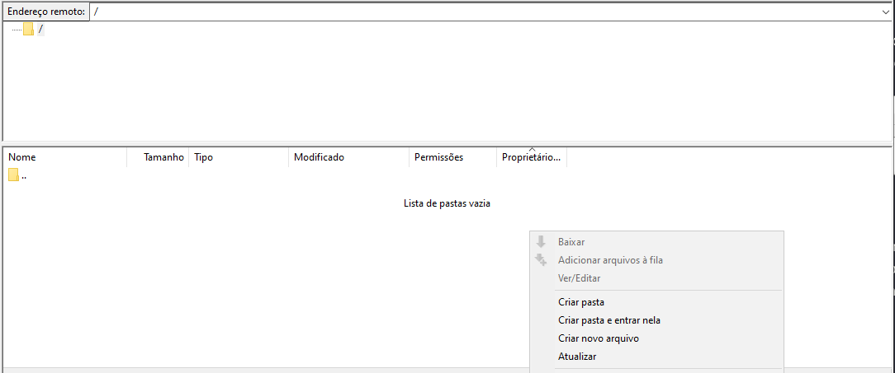

# Criação de um servidor FTP na instância EC2 da AWS

# Sumário
- [Pré-requisitos](#pré-requisitos)
- [Introdução](#introdução)
- [Configurando servidor FTP](#configurando-servidor-ftp)
    + [Baixando e habilitando FTP](#baixando-e-habilitando-ftp)
    + [Adição de regras no grupo de segurança](#adição-de-regras-no-grupo-de-segurança)
    + [Editando arquivo de configuração do FTP](#editando-arquivo-de-configuração-do-ftp)
- [Criando usuário do FTP](#criando-usuário-do-ftp)
- [Acessando o servidor FTP](#acessando-o-servidor-ftp)
- [Referências](#referências)

# Pré-requisitos
- Possuir conta na AWS.
- Estar com uma instância EC2 em execução com a AMI Linux 2.

# Introdução
O FTP (File Transfer Protocol) é usado para se comunicar e transferir arquivos entre computadores numa rede TCP/IP (Protocolo de Controle de Transmissão/Protocolo de Internet) — ou seja, na internet. Saiba mais sobre ele clicando [aqui](https://www.hostinger.com.br/tutoriais/ftp-o-que-e-como-funciona).

Nesse repositório vamos ver como acessar um servidor FTP hospedado numa instância EC2 da AWS e veremos também como acessar esse servido pelo aplicativo [Filezila](https://filezilla-project.org).

# Configurando servidor FTP

## Baixando e habilitando FTP
Vamos iniciar fazendo download dos serviços de FTP, para fazermos isso basta executar os seguinte comandos:
```bash
    yum install -y vsftpd
```
Após baixar o serviços de FTP teremos que habilita-los e inicia-los na instância:
```bash
    systemctl start vsftpd
    systemctl enable vsftpd
```

## Adição de regras no grupo de segurança

Em primeiro lugar, navegue até a página de gerenciamento de grupo de segurança, identifique o grupo de segurança responsável pela sua instância executando. Após isso, clique no em `Editar regras de entradas` e adicione as seguintes regra abaixo:



Após isso clique no botão `Salvar regras`.

## Editando arquivo de configuração do FTP

O arquivo de configuração do FTP fica no arquivo: `/etc/vsftpd/vsftpd.conf`

Vamos acessar esses arquivo com editor de texto e editar uma linha existe, no caso a opção `anonymous_enable=YES` para `anonymous_enable=NO`, após isso basta salvar o arquivo.

Agora, vamos acessar esse mesmo arquivo com um editor de texto novamente e adicionar as seguintes linhas ao fim do arquivo:

```
chroot_local_user=YES
allow_writeable_chroot=YES

pasv_enable=YES
pasv_min_port=1024
pasv_max_port=1048
pasv_address="Endereço público da instância"
```

As duas primeiras linhas farão com que arquivos possam ser gravados e baixados no servidor FTP e farão também com que o cliente que acessa o servidor FTP não possa navegar nos outros diretórios da minha instância. Já as quatro ultimas linhas permitem o acesso do servidor FTP. Obs.: Você deve preencher o último atributo de acordo com o endereço público da sua instância EC2(sem as aspas).

# Criando usuário do FTP

Após esses passos de configuração do servidor, devemos adicionar o usuário que será responsável pelo acesso a esse servidor FTP, além disso, devemos gerenciar suas permissões.
Então vamos iniciar criando um usuário:
```bash
    useradd ftpuser
 ```
Após criar o usuário é necessário criar uma senha para ele, através do seguinte comando:
```bash
    passwd ftpuser
```
Após possuir o usuário criado, devemos criar o diretório do FTP que será acessado pelo cliente(FileZilla). Irei criar no `/ftp/files`, por meio do seguinte:
```bash
    mkdir -p /ftp/files
```
Após criar esses diretórios devemos definir o diretório inicial do servidor FTP e gerenciar as permissões nele, podemos fazer o seguinte:

```bash
    usermod -d /ftp/files ftpuser
    chown ftpuser:ftpuser /ftp/files
    chmod g+w /ftp/files
```

Após isso, temos o necessário para ser possível o acesso do servidor FTP pelo FileZilla.
# Acessando o servidor FTP
Há alguns maneiras de acessar um servidor FTP, tanto pelo terminal, como por alguns aplicativos. No nosso caso, iremos utilizar o aplicativo [FileZilla](https://filezilla-project.org), ele é multiplataforma, então acesse o site oficial dele e faça o download de acordo com seu SO.

Então vamos seguir abrindo o aplicativo no FileZilla no computador pessoal, após isso devemos preencher algumas informações visualizadas na imagem abaixo:


- Preencha o campo `Host` com o IP público da sua instância EC2 em execução.
- Preencha o campo `Nome de usuário` com o nome do seu usuário criado na sessão anterior, no meu caso foi `ftpuser`
- Preencha o campo `Senha` com a senha definida na sessão anterior para o usuário criado

Após isso, pode clicar em `Conexão rápida`

Na própia tela do FileZilla há logs referente a conexão do servidor, seguindo esses passos ela deve mostrar que a conexão com servidor foi estabelecida. Com isso, ja podemos adicionar, editar, excluir, baixar e carregar arquivos e diretórios. Veja abaixo uma foto do FileZilla com a conexão feita e disponível para realizar algumas ações:



# Referências
- [Tutorial de como configurar  servidor FTP](https://medium.com/tensult/configure-ftp-on-aws-ec2-85b5b56b9c94) [Em inglês].